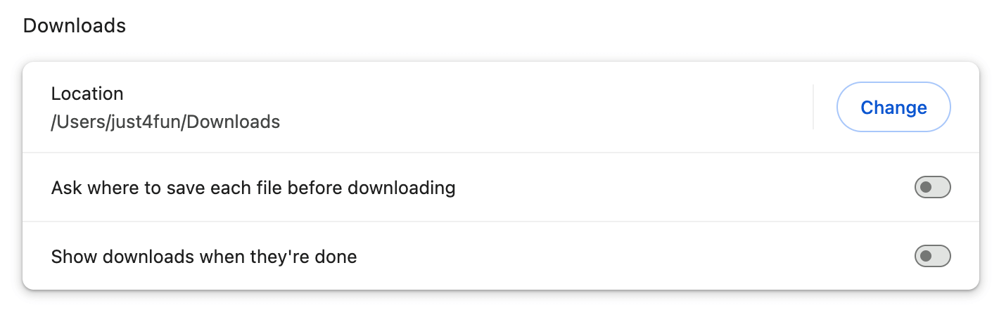
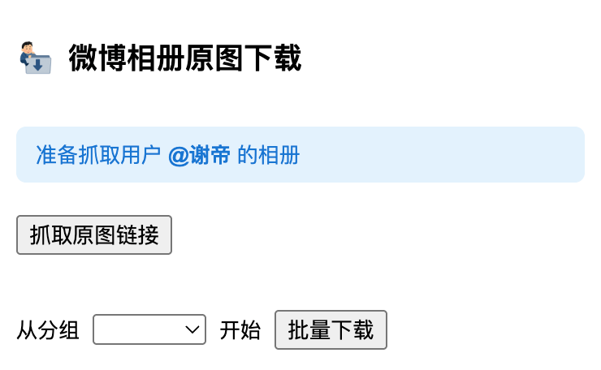
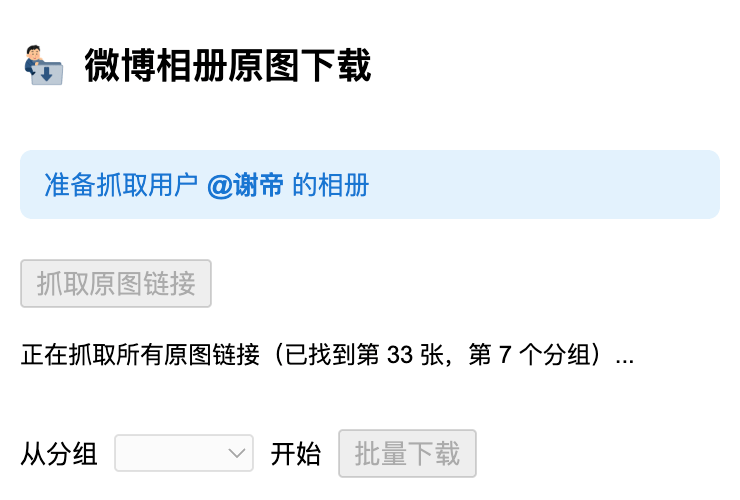
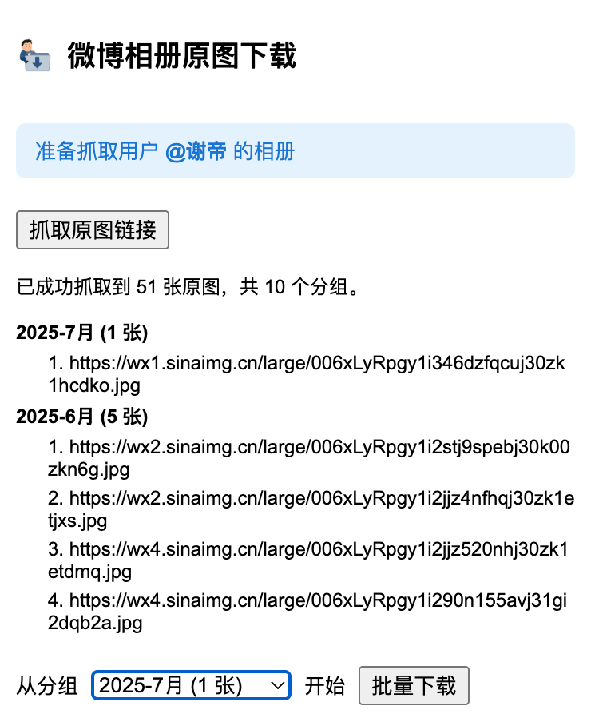
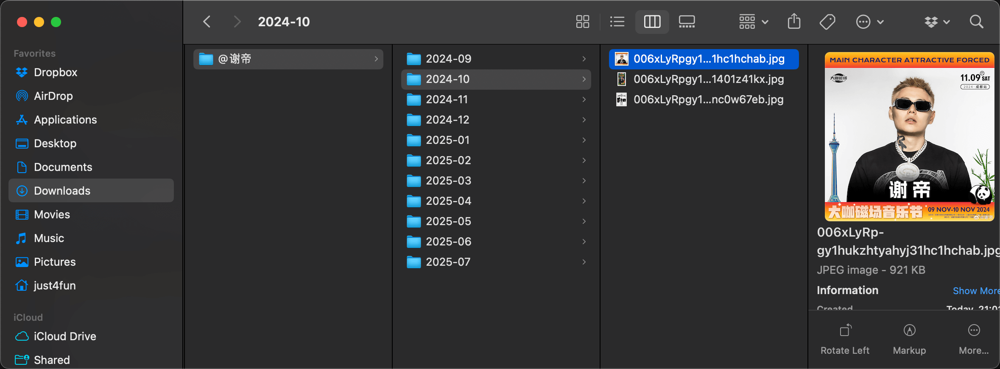

# Sina Weibo Album Downloader (Chrome Extension)

  

[简体中文版 README 在此 (README.zh-CN.md)](./README.zh-CN.md)

## Motivation

This extension was created to help me back up nearly 4,000 photos I uploaded to Weibo over 15 years (2011–2025). If you also want to archive your Weibo memories, this tool is for you.

> In the Simplified Chinese-speaking community, many people have gradually moved away from Sina Weibo to platforms like Xiaohongshu (rednote) and others. This shift is a key reason for wanting to back up your Weibo photos and memories.

## Prerequisites

- **Disable Chrome download settings:**
  Go to `chrome://settings/downloads` and turn off both "Ask where to save each file before downloading" and "Show downloads when they're done."

    

     
   

- **Why?**
  This allows the extension to automatically save each image to your default download folder without prompting you for every file, enabling smooth and unattended batch downloads.

## How to Use

1. **Navigate to the Weibo user's album page:**
   - Go to the Weibo user's profile page whose photos you want to download, then navigate to their album/photo section.

   

     
   

2. **Click "抓取原图链接" (Fetch Original Image Links):**
   - The browser will automatically scroll down the Weibo album page until it reaches the bottom, ensuring all image links are loaded and collected.

   

     
   

3. **Click "批量下载" (Batch Download):**
   - You can now close the popup. The images will continue downloading in the background as long as your browser remains open.

   

     
   

4. **Check Your Download Folder:**
   - Go to the folder specified in your Chrome download settings to view the download progress and find your images.
   - By default, all images will be saved in a folder named after the Weibo username, prefixed with @.

   

     
   

5. **💡 Tip: Resume Downloads After Page Refresh:**
   - If you accidentally refresh or close the current page, downloads will stop. You can click the fetch button again and select a specific group to start from, avoiding re-downloading previously downloaded photos.

## Why a Chrome Extension (Not a Desktop App or CLI Tool)?

- **Seamless Authentication:** The extension runs in your browser, automatically using your logged-in session, cookies, and headers—no need to manually copy cookies or simulate requests.
- **Bypass Anti-Hotlinking:** Fetching images as blobs from the Weibo page context avoids server-side anti-leeching (hotlink protection) that blocks direct downloads.
- **User-Friendly:** No programming knowledge or command line required. Just install, click, and download.
- **Safe and Stable:** Downloads are paced and managed by Chrome, reducing the risk of being rate-limited or blocked by Weibo.

## Why Not ZIP Batch Download?

- **Browser Limitations:** Chrome extensions cannot reliably create and download large ZIP files due to memory and security restrictions.
- **Popup Lifecycle:** The extension popup may be closed by Chrome during long operations, interrupting ZIP creation.
- **CORS and Anti-Leeching:** Direct downloads from the background script are blocked by Weibo's anti-hotlinking, so all downloads must be initiated from the page context.