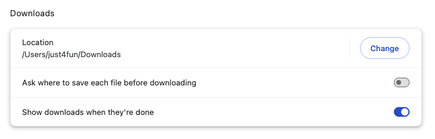
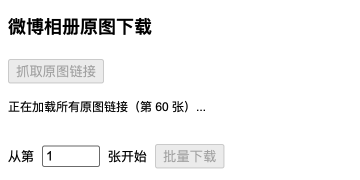
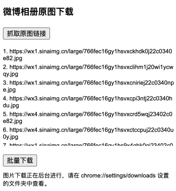

# 新浪微博相册批量下载器（Chrome 扩展）

  

[English README is available here (README.md)](./README.md)

## 项目动机

本扩展用于帮助我备份 2011–2025 年间上传到微博的近 4000 张照片。如果你也想归档自己的微博记忆，这个工具非常适合你。

> 在简体中文社区，许多人已经逐渐从新浪微博转向小红书等平台。这一变化也是想要备份微博照片和回忆的重要原因。

## 使用前提

- **关闭 Chrome 设置中的“下载前询问每个文件的保存位置”：**
  进入 `chrome://settings/downloads`，关闭“下载前询问每个文件的保存位置”。

    

     
   

- **为什么要这样设置？**
  这样可以让扩展自动将每张图片保存到你的默认下载文件夹，无需每次都弹窗确认，实现流畅的批量下载。

## 使用方法

1. **点击“抓取原图链接”按钮：**
   - 浏览器会自动滚动微博相册页面到底部，确保所有图片链接都被加载和收集。

   

     
   

2. **点击“批量下载”按钮：**
   - 此时你可以关闭弹窗，图片会在浏览器后台持续下载，只要浏览器未关闭即可。

   

     
   

3. **检查你的下载文件夹：**
   - 前往 Chrome 下载设置中指定的文件夹，查看下载进度和已保存的图片。
   - 默认所有图片会保存在名为 `weibo_album` 的文件夹中。

## 为什么用 Chrome 扩展（而不是桌面应用或命令行工具）？

- **无缝认证：** 扩展在浏览器中运行，自动使用你已登录的会话、Cookie 和请求头，无需手动复制 Cookie 或模拟请求。
- **绕过防盗链：** 在微博页面上下文中以 blob 方式获取图片，避免了服务器端的防盗链（反热链）限制，支持直接下载。
- **用户友好：** 无需编程知识或命令行操作，只需安装、点击、下载即可。
- **安全稳定：** 下载由 Chrome 管理和节流，降低被微博限速或封禁的风险。

## 为什么不支持打包 ZIP 批量下载？

- **浏览器限制：** Chrome 扩展无法可靠地创建和下载大体积 ZIP 文件，受限于内存和安全策略。
- **弹窗生命周期：** 扩展弹窗在长时间操作时可能被 Chrome 关闭，导致 ZIP 创建中断。
- **CORS 与防盗链：** 后台脚本直接下载会被微博防盗链拦截，所有下载必须在页面上下文中发起。 