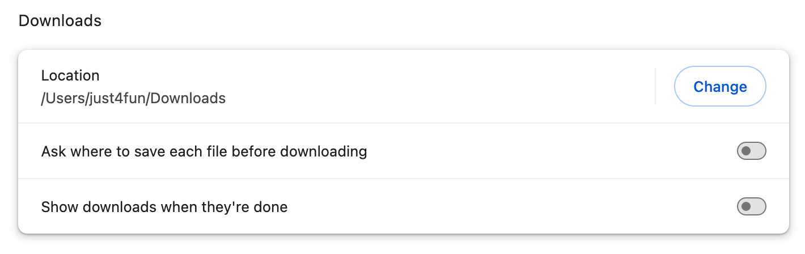
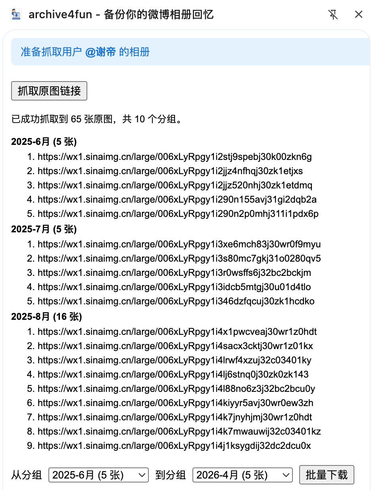
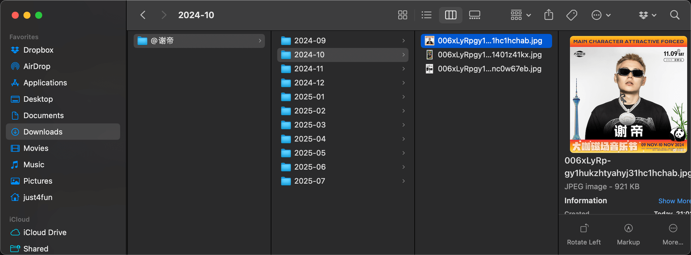

# 新浪微博相册批量下载器（Chrome 扩展）

  

[English README is available here (README.md)](./README.md)

## 项目动机

本扩展用于帮助我备份 2011–2025 年间上传到微博的近 4000 张照片。如果你也想归档自己的微博记忆，这个工具非常适合你。

> 在简体中文社区，许多人已经逐渐从新浪微博转向小红书等平台。这一变化也是想要备份微博照片和回忆的重要原因。

## 使用前提

- **关闭 Chrome 下载设置：**
  进入 `chrome://settings/downloads`，关闭"下载前询问每个文件的保存位置"和"下载完成后显示"。

    

     
   

- **为什么要这样设置？**
  这样可以让扩展自动将每张图片保存到你的默认下载文件夹，无需每次都弹窗确认，实现流畅的批量下载。

## 使用方法

1. **导航到微博用户的主页并打开侧边栏：**
   - 前往你想要下载照片的微博用户主页（如 `weibo.com/u/用户ID`），无需特意切换到相册 tab。
   - 点击工具栏中的扩展图标，打开侧边栏。

   

     
   

2. **点击"抓取原图链接"按钮：**
   - 插件会直接调用微博 API 获取全部图片链接，无需滚动页面。支持普通照片、GIF 动图和实况照片（Live Photo）。

   

     
   

3. **选择日期范围，点击"批量下载"按钮：**
   - 抓取完成后，图片会按年月分组。通过"从分组"和"到分组"两个下拉框选择你想下载的日期范围。
   - 与旧版弹窗不同（旧版点击任何地方都会关闭），只要不主动关闭侧边栏，你可以随意切换 tab、在左侧页面继续做其他事情，下载会在后台持续进行。注意：关闭侧边栏后重新打开，抓取状态会重置，建议整个使用过程中保持侧边栏开启。

   

     
   

4. **检查你的下载文件夹：**
   - 前往 Chrome 下载设置中指定的文件夹，查看下载进度和已保存的图片。
   - 图片保存在以微博用户名（前缀 @）命名的文件夹下，并按年月自动归类到子文件夹（如 `@用户名/2025-06/`）。

   

     
   

5. **💡 提示：页面刷新后恢复下载：**
   - 如果不小心刷新或关闭了当前页面，下载会停止。重新点击抓取按钮后，通过日期范围下拉框选择从上次中断的月份继续，避免重复下载已保存的照片。

6. **💡 提示：如何在 iPhone 上恢复实况照片（Live Photo）：**
   - 实况照片会下载为**两个同名文件**：一个 `.jpg`（静态图）和一个 `.mov`（动态片段）。两个文件均完整保留了 Apple 的原始 metadata（Content Identifier UUID），实况效果可以完整恢复。
   - **在 iPhone 上恢复实况照片的步骤：**
     1. 将 `.jpg` 和 `.mov` **同时**导入 **macOS 照片 App**（两个文件一起拖入）。
     2. 照片 App 会根据匹配的 metadata 自动将两者配对为实况照片。
     3. 开启 **iCloud 照片**同步，实况照片即可同步到 iPhone。
   - 注意：直接通过 AirDrop 将两个文件发送到 iPhone **无法**恢复实况效果，必须经由照片 App 导入配对。

## 为什么用 Chrome 扩展（而不是桌面应用或命令行工具）？

- **无缝认证：** 扩展在浏览器中运行，自动使用你已登录的会话、Cookie 和请求头，无需手动复制 Cookie 或模拟请求。
- **绕过防盗链：** 在微博页面上下文中以 blob 方式获取图片，避免了服务器端的防盗链（反热链）限制，支持直接下载。
- **用户友好：** 无需编程知识或命令行操作，只需安装、点击、下载即可。
- **安全稳定：** 下载由 Chrome 管理和节流，降低被微博限速或封禁的风险。

## 为什么不支持打包 ZIP 批量下载？

- **浏览器限制：** Chrome 扩展无法可靠地创建和下载大体积 ZIP 文件，受限于内存和安全策略。
- **侧边栏限制：** 即便有持久的侧边栏，在浏览器中创建大体积 ZIP 仍不稳定——Chrome 可能因内存或安全限制，在操作完成前终止任务。
- **CORS 与防盗链：** 后台脚本直接下载会被微博防盗链拦截，所有下载必须在页面上下文中发起。 